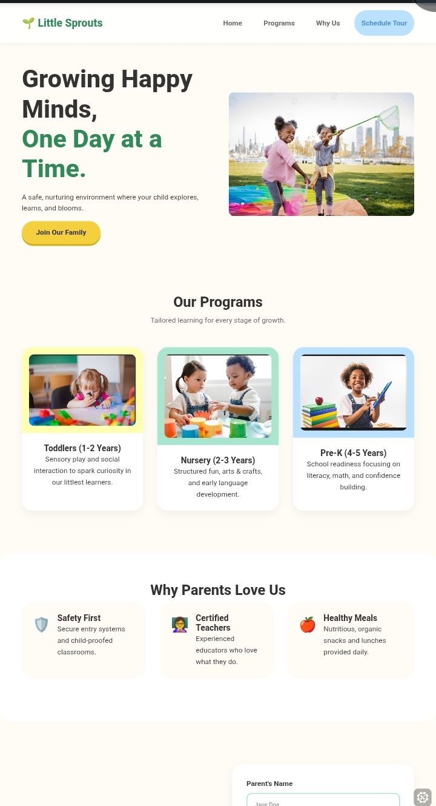
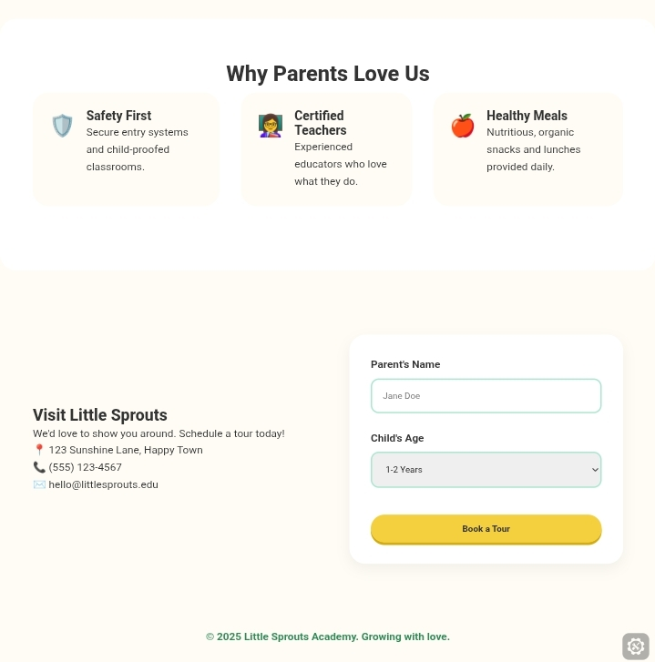

# 🎨 Kids Friendly Web App  

A fun, interactive, and kid-friendly web application built using **HTML, CSS, and JavaScript**.  
This project was designed with children in mind — simple interface, bright visuals, and easy interaction.

---

## 🌟 Features

- 🎯 Simple and intuitive user interface  
- 🌈 Bright and engaging design  
- 🧒 Built specifically for kids  
- ⚡ Fast and lightweight (Vanilla JavaScript)  
- 📱 Responsive design  

---

## 🛠️ Built With

- **HTML5** – Structure  
- **CSS3** – Styling & Layout  
- **JavaScript (Vanilla JS)** – Interactivity  

---

## 📸 Screenshots

<p align="center">
  
  <br/>
  
</p>

---

## 🎥 Demo Video

<p align="center">
  <a href="https://youtube.com/shorts/twIFDfKHCrg?si=ftzXidVKf84Ni6L0">
    Click here to view live demo on YouTube
  </a>
</p>


---

## 🚀 How to Run the Project

1. Clone the repository

```bash
git clone https://github.com/Webkingif/Kindergarten-School-website.git
